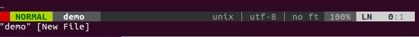

kai-vimrc
=========

这个脚本是配置vim的配置文件，当然前提是安装了vim。

写这个脚本的目的：
* 学习git的使用,学会如何有效的管理代码;
* 学习github的使用,包括面板中各个功能;
* 学习vimscript脚本语言;
* 配置适合自己的vim编辑环境.

### vim-powerline

* 配置  
  在vimrc中增加如下配置:

  ```
  " set powerline
  set laststatus=2	        " use 2 lines for the status bar
  ```

* 效果  
  
  


